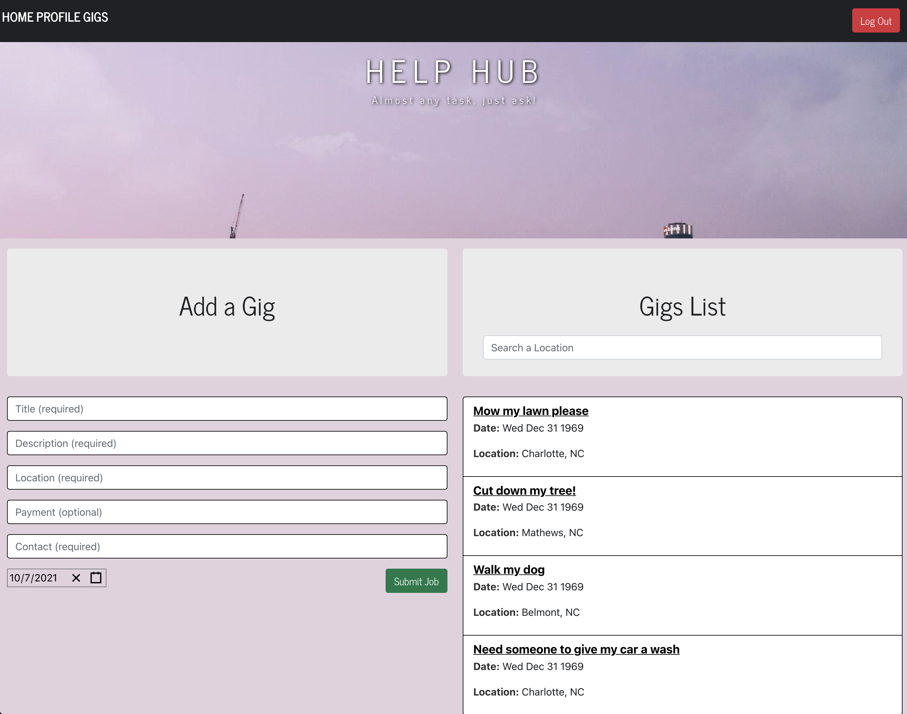

# HelpHub

## Description

Help hub is an application that allows users to view gigs or tasks around their city that they can volunteer to do while also earning money. This requires the user to create an account to view the gigs to sign up for and give information like their email, and gigs for others to view. Almost any task, just ask!

  ## Table of Contents
  
  * [Installation](#installation)
  
  * [Usage](#usage)
 
  * [Technologies](#technologies)
  
  * [License](#license)

  * [Tests](#tests)
  
  * [Questions](#questions)
  
  ## Installation
  
  To install necessary dependencies, run the following command: "npm i".

   ## Usage

To start the app in the CLI : "npm start"  

  ## Technologies
  
  Technologies used inclue MySQL, Node & Express, Javascript, React, Heroku, Bootstrap, Auth0, and Datepicker.

  ## License
    
    This application is licensed under the MIT license.
    

  ## Tests
  
  There are no tests for this application.
  
      
  ## Questions  

  If you have any questions about the repo or application, open an issue or contact:
  
  [Brian Robinson](https://github.com/brob92993)  |  [Omar Nava](https://github.com/omar-94) | [Cameron Blake](https://github.com/Cameron-Blake) | [Sanusi Cole](https://github.com/gohen1216) | [Taegan Loyzelle](https://github.com/tloyzelle)
  

  [HelpHub Repository](https://github.com/tloyzelle/Help-Hub.git)

  
  [Deployed application](https://helphub2022.herokuapp.com)
